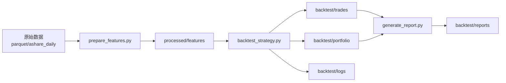

# 项目架构设计

## 数据分层架构

本项目采用三层数据架构，确保原始数据不变性、中间数据可重算、回测结果可追溯。

```
data/
├── parquet/              # 原始数据层（Raw Layer）
│   └── ashare_daily/     # A股日线数据 + hot_rank
│       ├── year=2025/
│       │   ├── month=01/
│       │   │   ├── {code}_{timestamp}.parquet
│       │   │   └── ...
│       │   └── month=12/
│       └── ...
│
├── processed/            # 处理数据层（Processed Layer）
│   ├── features/         # 特征工程输出
│   │   ├── daily_features_{version}.parquet  # 日频特征
│   │   ├── stock_metadata.parquet            # 股票元数据
│   │   └── manifest.json                     # 处理进度
│   ├── universe/         # 选股池
│   │   └── {strategy_name}_universe_{date}.parquet
│   └── signals/          # 策略信号
│       └── {strategy_name}_signals_{date}.parquet
│
└── backtest/             # 回测结果层（Backtest Layer）
    ├── trades/           # 交易明细
    │   └── {strategy_name}_{config_hash}_{date}.parquet
    ├── portfolio/        # 组合净值
    │   └── {strategy_name}_{config_hash}_{date}.parquet
    ├── reports/          # 分析报告
    │   ├── {strategy_name}_{config_hash}_report.md
    │   ├── {strategy_name}_{config_hash}_metrics.json
    │   └── {strategy_name}_{config_hash}_charts/
    │       ├── nav_curve.png
    │       ├── pnl_distribution.png
    │       └── holding_days.png
    └── logs/             # 实盘风格日志
        └── {strategy_name}_{date}.log
```

## 目录职责说明

### 1. parquet/（原始数据层）
- **定位**: 不可变的真实数据源（Source of Truth）
- **特性**: 
  - Append-only，只追加不修改
  - 由数据下载脚本统一管理
  - 按时间分区（year/month）存储
- **访问方式**: 
  - 优先使用 DuckDB 直接查询
  - 支持 PyArrow/Pandas 直接读取

### 2. processed/（处理数据层）
- **定位**: 可重新生成的中间数据
- **特性**:
  - 支持增量更新（通过 manifest.json 追踪）
  - 版本化管理（文件名包含版本号或日期）
  - 可删除并从 raw 层重建
- **子目录说明**:
  - **features/**: 特征工程结果（T-1信息、涨停价、技术指标等）
  - **universe/**: 各策略的选股池快照
  - **signals/**: 各策略的买卖信号

### 3. backtest/（回测结果层）
- **定位**: 策略评估与分析结果
- **特性**:
  - 按策略和配置哈希组织（支持多版本对比）
  - 包含完整的可复现信息（配置、日志、数据版本）
  - 定期归档旧版本
- **子目录说明**:
  - **trades/**: 逐笔交易明细（含成本、滑点、费用）
  - **portfolio/**: 每日组合状态（现金、持仓、净值）
  - **reports/**: Markdown报告、JSON指标、图表
  - **logs/**: 结构化日志（JSON Lines格式）

## 配置文件组织

```
config/
├── data_config.yaml              # 数据路径配置
├── backtest_base.yaml            # 回测基础配置（成本、滑点等）
└── strategies/                   # 各策略配置
    ├── hot_rank_drop7.yaml       # 人气榜-7%策略
    ├── momentum_reversal.yaml    # 动量反转策略
    └── template.yaml             # 策略配置模板
```

### 参数化设计原则

1. **所有策略参数必须可配置**：阈值、排名、时间窗口等
2. **CLI优先级最高**：支持命令行覆盖配置文件
3. **参数命名规范**：
   - 阈值类：`{action}_trigger`（如 drop_trigger, limit_down_trigger）
   - 排名类：`{entity}_top_n`（如 hot_top_n）
   - 开关类：`{action}_on_{condition}`（如 exit_on_limit_down）
4. **对称性设计**：买入和卖出参数应保持对称（如买入-7%，卖出也用-7%判断）

### 配置文件示例

**config/data_config.yaml**
```yaml
# 数据路径配置
data:
  raw_dir: "data/parquet/ashare_daily"
  processed_dir: "data/processed"
  backtest_dir: "data/backtest"
  
  # DuckDB 配置
  duckdb:
    memory_limit: "4GB"
    threads: 4
```

**config/backtest_base.yaml**
```yaml
# 回测通用配置（可被策略覆盖）
backtest:
  # 数据范围
  start_date: "2025-01-02"
  end_date: "2025-12-31"
  
  # 资金管理
  init_cash: 100000         # 初始资金（元）
  position_limit: 20        # 最大持仓数量
  
  # 交易成本
  fee_buy: 0.0002           # 买入佣金
  fee_sell: 0.0002          # 卖出佣金
  stamp_tax_sell: 0.001     # 印花税（仅卖出）
  slippage_bps: 5           # 滑点（基点）
  min_commission: 5         # 最低佣金（元）
  
  # 通用过滤规则
  filter_st: true           # 过滤ST股票
  filter_suspend: true      # 过滤停牌股票
  min_lot_size: 100         # 最小交易单位（股）
```

**config/strategies/hot_rank_drop7.yaml**
```yaml
# 策略名称和版本
strategy:
  name: "hot_rank_drop7_hold_limitup"
  version: "1.0.0"
  description: "人气榜前N名次日-7%买入，涨停不卖"
  
# 继承基础配置
extends: "../backtest_base.yaml"

# 策略特定参数
params:
  hot_top_n: 100            # 人气榜前N名
  prev_amount_min: 1.0e9    # 前日成交额最小值（10亿元）
  drop_trigger: 0.07        # 触发买入阈值（-7%）
  per_trade_cash_frac: 0.1  # 每笔资金占比（10%）
  
  # 退出规则
  exit_rule: "hold_limitup"  # 涨停不卖，首个非涨停日收盘卖
  max_hold_days: 30          # 最大持仓天数（防止长期停牌）
  
# 涨停规则（A股板块）
limit_up_rules:
  main_board: 0.10      # 主板/中小板
  gem_board: 0.20       # 创业板（300/301）
  star_board: 0.20      # 科创板（688/689）
  bse_board: 0.30       # 北交所（8/4）
  st_stock: 0.05        # ST股票
  price_precision: 0.01 # 价格精度（元）
```

## 数据流与脚本依赖



### 脚本职责

| 脚本 | 输入 | 输出 | 功能 |
|-----|------|------|------|
| `scripts/prepare_features.py` | raw数据 | processed/features | 特征工程（T-1信息、涨停价等） |
| `scripts/backtest_strategy.py` | features + 策略配置 | trades + portfolio + logs | 回测引擎（逐日模拟交易） |
| `scripts/generate_report.py` | trades + portfolio | reports + charts | 生成统计报告和图表 |
| `scripts/compare_strategies.py` | 多个backtest结果 | 对比报告 | 多策略横向对比 |

## 技术栈

### 核心库
- **数据处理**: Pandas 2.3+, PyArrow 22.0+
- **查询引擎**: DuckDB 1.4+（零ETL直接查询Parquet）
- **数值计算**: NumPy 1.26+
- **可视化**: Matplotlib 3.8+

### 数据格式
- **Parquet**: 列式存储，支持压缩和分区
- **JSON Lines**: 日志格式，便于流式处理
- **YAML**: 配置文件格式

## 扩展性设计

### 1. 多策略支持
- 配置文件独立：每个策略一个YAML
- 结果隔离：文件名包含策略名和配置哈希
- 可插拔架构：信号生成器、过滤器、退出规则可替换

### 2. 增量更新
- Manifest追踪：记录已处理的数据范围
- 分区读取：只读取需要的时间分区
- 结果缓存：中间结果可复用

### 3. 版本管理
- 配置哈希：确保结果可追溯到配置版本
- 数据版本：features文件名包含生成日期
- Git集成：配置文件纳入版本控制

### 4. 性能优化
- DuckDB并行：利用多核加速查询
- 懒加载：按需读取数据分区
- 内存管理：大数据集分批处理

## 命名规范

### 文件命名
```
{entity_type}_{strategy_name}_{config_version}_{date}.{ext}

示例:
- trades_hot_rank_drop7_v1_20260102.parquet
- portfolio_momentum_v2_20260102.parquet
- signals_hot_rank_drop7_20250301.parquet
```

### 列名规范
```python
# 时间列: date, datetime, timestamp
# 代码列: code (6位字符串)
# 价格列: open, high, low, close, vwap
# 成交列: volume (股), amount (元), turnover (%)
# 收益列: return, pnl, pnl_pct
# 排名列: rank, hot_rank
# 后缀: _t1 (T-1), _prev (前值), _ma (均线)
```

## 最佳实践

### 1. 数据访问
```python
import duckdb

# 推荐：使用DuckDB直接查询Parquet
con = duckdb.connect()
df = con.execute("""
    SELECT date, code, close, hot_rank
    FROM 'data/parquet/ashare_daily/**/*.parquet'
    WHERE date BETWEEN '2025-01-01' AND '2025-12-31'
    AND hot_rank IS NOT NULL
""").df()

# 备选：PyArrow读取（适合小数据集）
import pyarrow.parquet as pq
df = pq.read_table('data/processed/features/daily_features_v1.parquet').to_pandas()
```

### 2. 配置管理
```python
import yaml

def load_strategy_config(strategy_name: str) -> dict:
    """加载策略配置（支持继承）"""
    config_path = f"config/strategies/{strategy_name}.yaml"
    with open(config_path) as f:
        config = yaml.safe_load(f)
    
    # 处理extends继承
    if 'extends' in config:
        base_path = Path(config_path).parent / config['extends']
        with open(base_path) as f:
            base_config = yaml.safe_load(f)
        # 深度合并
        config = deep_merge(base_config, config)
    
    return config
```

### 3. 日志记录
```python
import logging
import json

# 结构化日志（JSON Lines格式）
def log_trade(event: str, **kwargs):
    """记录交易事件"""
    log_entry = {
        "timestamp": datetime.now().isoformat(),
        "event": event,
        **kwargs
    }
    logger.info(json.dumps(log_entry, ensure_ascii=False))

# 使用示例
log_trade("BUY", date="2025-03-15", code="600519", 
          price=1650.83, shares=100, cost=165116.53)
```

## 未来扩展方向

1. **实时数据支持**: 将架构扩展到支持日内数据
2. **多因子框架**: 特征工程模块化，支持因子组合
3. **分布式回测**: 使用Dask/Ray并行回测多策略
4. **Web界面**: 基于Streamlit的交互式分析平台
5. **ML集成**: 集成机器学习模型预测模块
