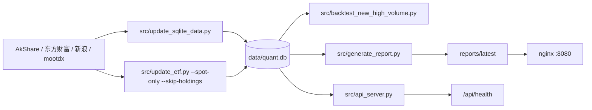

# 项目架构

本文档只描述当前有效架构。旧 parquet 下载、旧 Pages 发布和一次性诊断材料已经迁入 `archive/`，不再作为主开发入口。

## 总览


```mermaid
flowchart LR
    Sources["AkShare / 东方财富 / 新浪 / mootdx"] --> Update["src/update_sqlite_data.py"]
    Sources --> ETF["src/update_etf.py --spot-only --skip-holdings"]
    Update --> DB[("data/quant.db")]
    ETF --> DB
    DB --> Backtest["src/backtest_new_high_volume.py"]
    DB --> Report["src/generate_report.py"]
    DB --> API["src/api_server.py"]
    Report --> Latest["reports/latest"]
    Latest --> Nginx["nginx :8080"]
    API --> Health["/api/health"]
```

核心原则：

- SQLite 是当前主数据存储，生产数据库位于 `/data/quant_research/data/quant.db`。
- `reports/`、`logs/`、`data/` 下的运行产物不提交到 Git。
- 静态页面由 `src/generate_report.py` 生成，Flask API 只提供查询和健康检查。
- GitHub Actions 只保留 Oracle 部署链路，不再维护 GitHub Pages 发布链路。

## 生产部署

| 项目 | 值 |
| --- | --- |
| 服务器 | Oracle Cloud |
| 生产目录 | `/data/quant_research` |
| Python 虚拟环境 | `/data/quant_research_venv` |
| SQLite 数据库 | `/data/quant_research/data/quant.db` |
| 静态报告目录 | `/data/quant_research/reports/latest` |
| API systemd 服务 | `quant-api.service` |
| 日更 systemd 服务 | `quant-daily.service` |
| 日更 timer | `quant-daily.timer` |

部署入口：

```bash
REFRESH_HOT_RANK_FALLBACK=0 RESTART_API=1 RUN_FULL_PIPELINE=0 bash deploy/scripts/deploy_oracle.sh
```

GitHub Actions 工作流：

```text
.github/workflows/deploy.yml
```

该 workflow 通过 SSH 登录 Oracle 主机，执行 `git pull --ff-only origin master` 后运行部署脚本。

## 数据流

日更主链路由 `deploy/scripts/quant-daily-run.sh` 定义，生产 systemd 实际执行副本位于：

```text
/data/quant_research/logs/quant-daily-run.sh
```

任务顺序：

1. `src/update_sqlite_data.py`：更新 A 股日线、人气榜、涨停池、龙虎榜、市场温度。
2. `src/update_etf.py --spot-only --skip-holdings`：更新 ETF 当日快照，不在主链路采集持仓。
3. `src/update_zt_pool.py`：补充涨停池相关数据。
4. `src/backfill_lhb.py`：增量补龙虎榜。
5. `src/backfill_market_daily.py` 和 `src/backfill_market_daily_calc.py`：补市场宽度统计。
6. `src/backtest_new_high_volume.py`：更新策略回测结果。
7. `src/generate_report.py`：生成 `reports/latest`、`summary.json`、`monitor.html`。

详细说明见 [数据流水线](DATA_PIPELINE.md)。

## SQLite 表

当前报告和 API 主要依赖以下表：

| 表 | 用途 |
| --- | --- |
| `stocks` | 股票基础信息 |
| `daily_bars` | A 股日线行情 |
| `popularity_rankings` | 东方财富/多源人气榜 |
| `limit_up_pool` | 涨停池 |
| `zt_pool` | legacy 涨停池兼容表 |
| `lhb_records` | 龙虎榜记录 |
| `lhb_seats` | 龙虎榜席位 |
| `market_daily` | 市场涨跌停、情绪指标 |
| `etf_daily` | ETF 快照和技术指标 |
| `strategy_backtests` | 策略回测摘要 |

健康检查会按交易日判断关键表是否更新到最新有效交易日。

## API 和页面

| 入口 | 类型 | 用途 |
| --- | --- | --- |
| `/` | 静态页面 | 首页、模块导航、最新数据和 Git commit |
| `/report.html` | 静态页面 | 综合报告 |
| `/hot_rank_iframe.html` | 静态页面 | 人气热榜 |
| `/longhu.html` | 静态页面 | 龙虎榜 |
| `/etf.html` | 静态页面 | ETF 雷达 |
| `/monitor.html` | 静态页面 | 运行监控、数据模块状态、日志路径、Git commit |
| `/api/health` | Flask API | 模块级健康检查和部署版本 |

`/api/health` 总状态规则：

- 必需模块最新日期达到 `expected_trade_date` 时返回 `ok`。
- 必需模块落后或查询失败时返回 `error`。
- 非必需 legacy warning 保留在 `warnings`，但不影响总状态。
- Git 信息来自当前仓库，包括 commit、branch、commit_time、dirty。

## Git 和运行产物

仓库只管理代码、配置、部署脚本和工程文档。以下内容是运行产物：

| 路径 | 说明 |
| --- | --- |
| `data/quant.db` | 本地 SQLite 数据库 |
| `data/hot_sources/` | 热榜回补数据 |
| `data/experiments/` | 本地实验输出 |
| `reports/` | 静态页面、回测报告、CSV/HTML 导出 |
| `logs/` | 本地日志 |

这些路径已在 `.gitignore` 中排除。生产环境的运行产物通过部署脚本和日更任务生成，不通过 Git 提交。

## 后续架构规则

- 新增数据模块必须进入 `/api/health.modules`。
- 新增长跑任务必须由 systemd 管理，不能用临时 shell loop。
- 新增外部数据源必须有超时、重试和兜底策略。
- 新增报告页面必须由 `src/generate_report.py` 统一生成，并在 `monitor.html` 可追踪版本。
- 影响长期行为的技术决策必须新增 ADR，放入 `docs/adr/`。
